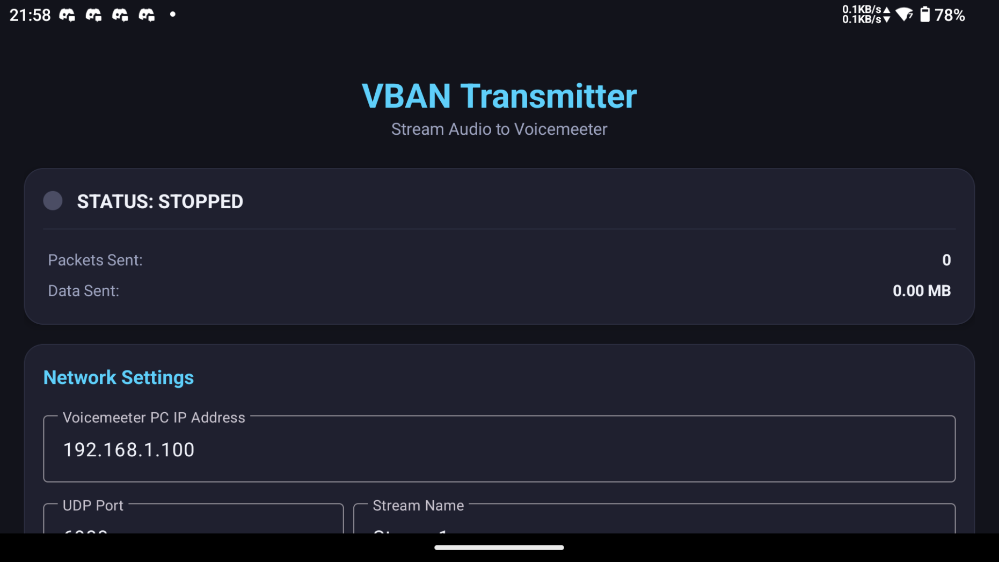

# VBAN Transmitter for Android

[日本語](README.md) | [English](README_en.md)

This project is an Android application that streams audio from an Android device (microphone or internal playback audio on Android 10+) to **Voicemeeter** running on a Windows PC in real time over a local Wi-Fi network using the VBAN protocol.

## Features
* **System Audio Capture (Android 10+)**: Stream background music or game audio directly to Voicemeeter.
* **Microphone Streaming**: Stream microphone audio for use as an audio input source on the PC side.

---

## Requirements

### Development / Build Environment
* **Android Studio** (latest stable version recommended)
* **JDK 17** (bundled with Android Studio)
* **Android SDK 34** (API 29+ supported)

### Runtime Environment
* Android 10 (API 29) or higher device (required for system audio capture)
* Windows PC with Voicemeeter, Voicemeeter Banana, or Voicemeeter Potato installed
* Both devices must be connected to the **same LAN**

---

## Installation

### Via Obtainium
You can install and keep the app up-to-date using [Obtainium](https://github.com/ImranR98/Obtainium), an Android app that fetches releases directly from GitHub.

1. Install Obtainium from [GitHub Releases](https://github.com/ImranR98/Obtainium/releases) or [F-Droid](https://f-droid.org/packages/dev.imranr.obtainium.fdroid/).
2. Open Obtainium and tap the **+** button.
3. Enter the repository URL: `https://github.com/thakyuu/VBAN_Transmitter_Android`
4. Tap **Add**. Obtainium will automatically detect the latest APK release and install it.
5. Obtainium will check for updates periodically and notify you when a new version is available.

---

## Build & Run

### 1. Import the Project
1. Launch Android Studio.
2. Select **Open** and navigate to the project root folder.
3. Gradle sync will start automatically. Wait for it to complete.
   * Android Studio will automatically download the necessary build tools and SDK.

### 2. Run the App
1. Connect an Android device in debug mode to your PC, or set up an emulator.
2. Click the Run button (green triangle icon) at the top to build and install the app.

---

## Setup & Usage

### 1. Windows PC (Voicemeeter) Setup
1. Launch **Voicemeeter** on Windows.
2. Click the **VBAN** button in the top-right to open the VBAN settings window.
3. Toggle VBAN **ON** (green).
4. On the first row of **Incoming Streams**, configure the following:
   * **On/Off**: Check `ON`
   * **Stream Name**: `Stream1` (must exactly match the app setting; case-sensitive)
   * **IP Address**: Enter the "Local Device IP" shown at the bottom of the Android app screen, or leave blank for auto-detection.
   * **Route to**: Select `Virtual Input (VAIO)` or any desired input.

### 2. Android App Setup
1. Launch the app on your Android device.
2. Enter the Windows PC's local IP address in **Voicemeeter PC IP Address**.
   * *(Find the Windows IP by running `ipconfig` in Command Prompt and checking the IPv4 address)*
3. Enter `6980` for **UDP Port** (default) and `Stream1` for **Stream Name**.
4. Select the Audio Source, Sample Rate, and Channels.
   * *Recommended: Source = System Audio, Sample Rate = 48000 Hz, Channels = Stereo (2 Channels)*
5. Tap the **START TRANSMISSION** button.
6. Grant microphone permission and screen recording/casting consent when the system dialogs appear (**Allow / Start Now**).
7. Once transmission begins, the status will change to **TRANSMITTING...** and the packet count and data volume will increase in real time. Verify that audio is reaching Voicemeeter on Windows.

---

## License

This project is released under the **MIT License**. See the [LICENSE](LICENSE) file for details.

See [NOTICE.md](NOTICE.md) for third-party open source licenses used by this project.

---

## Trademarks

VBAN and Voicemeeter are trademarks of [VB-Audio Software](https://vb-audio.com). This application is not affiliated with VB-Audio and is an unofficial third-party tool. The VBAN protocol specification is [publicly available from VB-Audio](https://vb-audio.com/Voicemeeter/vban.htm), and this application is an independent implementation.

